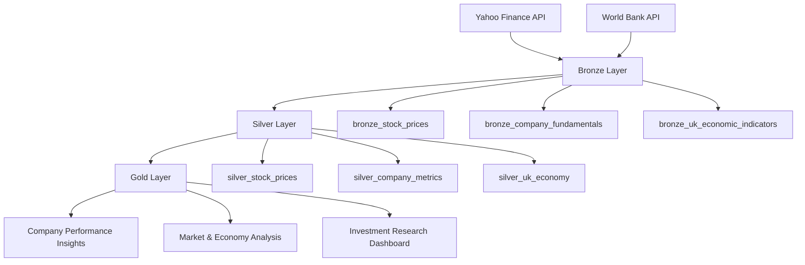

UK Financial Market Lakehouse

A financial data engineering project that builds a cloud-style lakehouse architecture using market data, company fundamentals, and UK economic indicators.

The project demonstrates a complete data pipeline workflow:

**Ingestion → Bronze → Silver → Gold Analytics**

The goal is to create a platform that can combine company performance with wider UK economic conditions to generate meaningful financial insights.

---

# 🏗️ Architecture



---

# 📊 Data Sources

## 1. Yahoo Finance

Used for market and company-level financial data.

Datasets:

* Historical stock prices
* Company fundamentals

Examples:

* Share price movements
* Trading volume
* Market capitalisation
* Company metrics

---

## 2. World Bank API

Used for UK economic indicators.

Datasets:

* GDP growth
* Inflation
* Unemployment

Purpose:

To connect company performance with wider economic conditions.

---

# 🥉 Bronze Layer

The Bronze layer stores raw ingested data with minimal transformation.

Current tables:

| Table                         | Source        | Purpose               |
| ----------------------------- | ------------- | --------------------- |
| bronze_stock_prices           | Yahoo Finance | Daily market prices   |
| bronze_company_fundamentals   | Yahoo Finance | Company information   |
| bronze_uk_economic_indicators | World Bank    | UK macroeconomic data |

---

# 🥈 Silver Layer

The Silver layer cleans and prepares data for analysis.

Transformations include:

* Standardising column names
* Removing unnecessary fields
* Handling duplicates
* Creating calculated metrics
* Preparing analytical datasets

Planned tables:

| Table                  | Purpose                        |
| ---------------------- | ------------------------------ |
| silver_stock_prices    | Clean market data with returns |
| silver_company_metrics | Clean company fundamentals     |
| silver_uk_economy      | Prepared economic indicators   |

---

# 🥇 Gold Layer

The Gold layer creates business and investment insights.

Planned analytical outputs:

## Company Performance

Examples:

* Best performing companies
* Daily returns
* Volatility analysis
* Price trends

## Market Environment

Combines:

* Stock performance
* Inflation
* GDP growth
* Unemployment

Possible insights:

* How economic conditions affect markets
* Company resilience during economic changes

## Investment Research

Combines:

* Company fundamentals
* Market performance

To support:

* Company comparison
* Financial analysis
* Investment research

---

# 🛠️ Technology Stack

| Technology        | Purpose                           |
| ----------------- | --------------------------------- |
| Python            | Data ingestion and transformation |
| DuckDB            | Analytical database               |
| Pandas            | Data processing                   |
| Yahoo Finance API | Market data                       |
| World Bank API    | Economic data                     |
| Git/GitHub        | Version control                   |

---

# 📁 Project Structure

```
financial_market_lakehouse

│
├── data
│   └── financial_market.duckdb
│
├── ingestion
│   ├── ingest_stock_prices.py
│   ├── ingest_company_fundamentals.py
│   └── ingest_world_bank.py
│
├── checks
│   ├── check_stock_prices.py
│   ├── check_fundamentals.py
│   └── check_world_bank.py
│
├── silver
│   └── cleaning pipelines
│
├── gold
│   └── analytics models
│
├── README.md
└── .gitignore
```

---

# 🎯 Project Goals

This project demonstrates:

✅ Multi-source financial data ingestion
✅ Lakehouse architecture principles
✅ Data modelling with Bronze/Silver/Gold layers
✅ Financial analytics preparation
✅ Real-world data engineering practices

---

# 🚀 Future Improvements

Future development:

* Add automated pipelines
* Add data quality checks
* Add dashboard layer
* Add more financial analytics
* Deploy using cloud services

---

# Author

Financial Market Lakehouse Project
