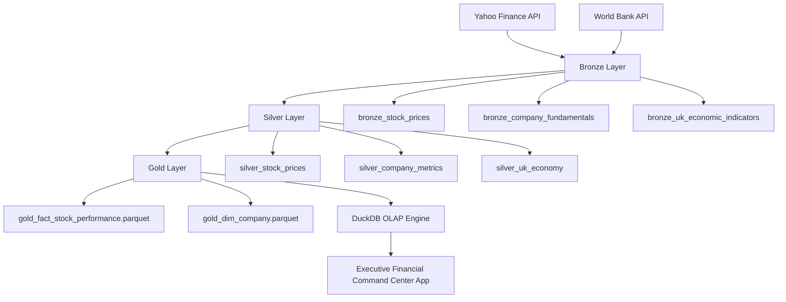

# 🇬🇧 UK Financial Market Lakehouse

A financial data engineering project that builds a cloud-style lakehouse architecture using market data, company fundamentals, and UK economic indicators.

The project demonstrates a complete data pipeline workflow:

**Ingestion → Bronze → Silver → Gold Analytics → Executive Dashboard**

The goal is to create a platform that can combine company performance with wider UK economic conditions to generate meaningful financial insights, visualized through an interactive executive command center.

## 🚀 Live Executive Command Center

**Explore the interactive Streamlit dashboard:**

👉 [Financial Market Lakehouse Analysis](https://financial-market-lakehouse-analysis.streamlit.app/)

---

# 🏗️ Architecture



---

# 📊 Data Sources

## 1. Yahoo Finance

Used for market and company-level financial data across major tech assets (`AAPL`, `MSFT`, `NVDA`, `AMZN`, `GOOGL`).

### Datasets

* Historical stock prices
* Company fundamentals

### Examples

* Share price movements
* Trading volume
* Market capitalisation
* Company metrics

---

## 2. World Bank API

Used for UK economic indicators.

### Datasets

* GDP growth
* Inflation
* Unemployment

### Purpose

To connect company performance with wider economic conditions.

---

# 🥉 Bronze Layer

The Bronze layer stores raw ingested data with minimal transformation inside an in-memory or file-backed DuckDB database.

### Current Tables

| Table                           | Source        | Purpose               |
| ------------------------------- | ------------- | --------------------- |
| `bronze_stock_prices`           | Yahoo Finance | Daily market prices   |
| `bronze_company_fundamentals`   | Yahoo Finance | Company information   |
| `bronze_uk_economic_indicators` | World Bank    | UK macroeconomic data |

---

# 🥈 Silver Layer

The Silver layer cleans and prepares data for analysis.

### Transformations Include

* Standardising column names
* Removing unnecessary fields
* Handling duplicates
* Creating calculated metrics
* Preparing analytical datasets

### Current Tables

| Table                    | Purpose                        |
| ------------------------ | ------------------------------ |
| `silver_stock_prices`    | Clean market data with returns |
| `silver_company_metrics` | Clean company fundamentals     |
| `silver_uk_economy`      | Prepared economic indicators   |

---

# 🥇 Gold Layer & Executive Dashboard

The Gold layer creates business and investment insights, structured into a high-performance Star Schema and exported as columnar `.parquet` files for fast OLAP querying.

## Analytical Outputs & BI Features

### Company Performance Insights

* Best performing companies
* Daily returns and volume tracking
* 30-Day Rolling Annualized Volatility analysis
* Price trends across multi-asset portfolios (`AAPL`, `MSFT`, `NVDA`, `AMZN`, `GOOGL`)

### Market Environment & Macro Analysis

Combines:

* Stock performance
* Inflation
* GDP growth
* Unemployment

Possible insights:

* How economic conditions affect markets
* Company resilience during macroeconomic changes

### Investment Research & Executive Command Center (`app.py`)

Combines company fundamentals and market performance into an interactive web application featuring:

* **Interactive Cross-Filtering:** Clickable liquidity bar charts that dynamically filter companion time-series trends and data matrices.
* **Automated Data Storytelling:** Built-in insights engine highlighting peak market risk dates and maximum return spikes automatically.
* **Star Schema Data Matrix:** Formatted tabular inspection windows featuring currency, volume, and volatility formatting.

### 🌐 Live Dashboard

Access the deployed Executive Financial Command Center here:

👉 [Open the Streamlit Executive Command Center](https://financial-market-lakehouse-analysis.streamlit.app/)

---

# 🛠️ Technology Stack

| Technology        | Purpose                           |
| ----------------- | --------------------------------- |
| Python            | Data ingestion and transformation |
| DuckDB & Parquet  | Analytical database & storage     |
| Pandas & Plotly   | Data processing and visualization |
| Streamlit Cloud   | Web application deployment        |
| Yahoo Finance API | Market data                       |
| World Bank API    | Economic data                     |
| Git/GitHub        | Version control and CI/CD         |

---

# 📁 Project Structure

```text
financial_market_lakehouse
│
├── data
│   ├── financial_market.duckdb
│   └── gold_exports
│       ├── gold_fact_stock_performance.parquet
│       ├── gold_dim_company.parquet
│       ├── gold_dim_date.parquet
│       └── gold_dim_uk_economy.parquet
│
├── ingestion
│   ├── ingest_stock_prices.py
│   ├── ingest_company_fundamentals.py
│   └── ingest_world_bank.py
│
├── checks
│   ├── check_stock_prices.py
│   ├── check_fundamentals.py
│   └── check_world_bank.py
│
├── silver
│   └── cleaning pipelines
│
├── gold
│   ├── build_gold.py
│   └── export_gold.py
│
├── app.py                # Executive Financial Command Center
├── requirements.txt      # Cloud dependencies
├── README.md
└── .gitignore
```

---

# 🎯 Project Goals

This project demonstrates:

✅ Multi-source financial data ingestion

✅ Lakehouse architecture principles (Bronze/Silver/Gold)

✅ Star Schema data modelling with DuckDB & Parquet

✅ Quantitative risk analytics and automated insights

✅ Production-grade web deployment using Streamlit Cloud

---

# 🚀 Future Improvements

Future development:

* Add automated pipeline execution via GitHub Actions
* Add comprehensive automated data quality validation checks
* Expand macroeconomic cross-asset correlations
* Deploy advanced portfolio optimization tools

---

# Author

**Financial Market Lakehouse Project**

**Samuel Adebusoye**

[🚀 View the Live Executive Financial Command Center](https://financial-market-lakehouse-analysis.streamlit.app/)
